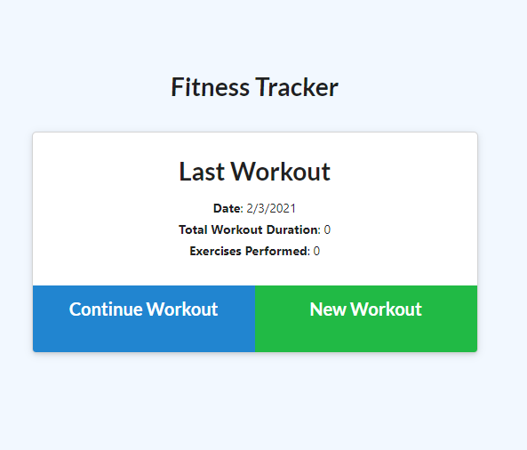
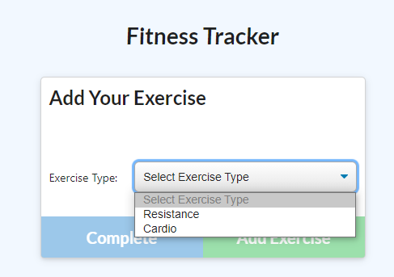
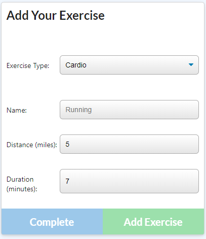
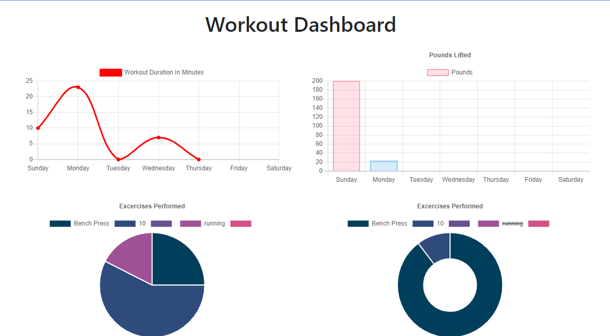

# Workout Tracker

## Table of Contents

* [overview](#overview)
* [Links](#links)
* [Screenshots](#screenshots)
* [Installation](#installation)
* [Usage](#usage)
* [Technologies Used](#technologies)
* [Questions](#questions)

## overview

Create and continue your workouts in this fitness tracker for weights and cardio.

## Links

[See the Deployed Application](https://workout-tracker-36559.herokuapp.com/)

## Screenshots

## Installation Instructions

run "npm i" in the command line

## Usage

On the landing page you are shown you last workout, you can choose to continue your last workout or start a new workout which will override the old workout information. You can add multiple workouts to your new workout including both cardio and weights. After you have added all your excersizes to your workout you can view information about your overall workout with graphs and visuals in the workout dashboard with is accessable though the navbar.

## Technologies Used

 API, HTML, CSS, MVC-structure
 
## Questions

If you have further projects and questions, you can find me on Github: [GITHUB](https://github.com/benimahat1291). 
please visit my portfolio to find contact information: [BENI MAHAT](https://benimahat1291.github.io/Portfolio_v2/#/). 

